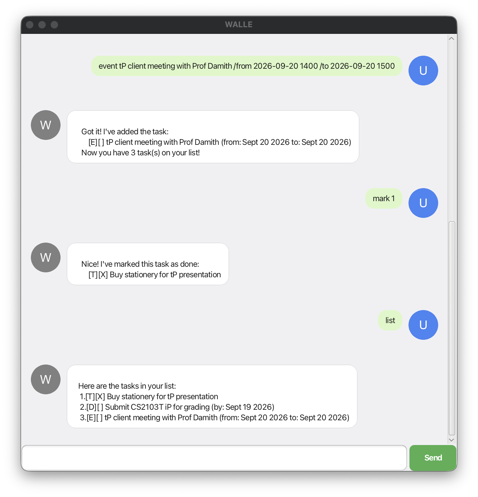

# WALLE User Guide



WALLE is a **desktop app for managing tasks and notes, optimised for use via a chat-style interface**. If you can type fast, WALLE can help you track your tasks faster than a traditional GUI app.

## Quick start

1. Ensure you have **Java 25** installed on your computer.
2. Download the latest `walle.jar` from the [releases page](https://github.com/edwardheww/ip/releases) of this repo.
3. Copy the file to the folder you want to use as the _home folder_ for WALLE.
4. Open a terminal in that folder and run:
   ```
   java -jar walle.jar
   ```
   A window similar to the one above should appear in a few seconds.
5. Type a command in the box at the bottom and press <kbd>Enter</kbd> (or click **Send**) to try it out. Some examples:
   - `todo Buy stationery for tP presentation` — adds a todo.
   - `list` — lists all your tasks.
   - `mark 1` — marks the 1st task in the list as done.
6. Refer to the [Features](#features) section below for details of every command.

## Features

> **Notes about the command format**
> - Words in `UPPER_CASE` are parameters to be supplied by you, e.g. in `todo DESCRIPTION`, `DESCRIPTION` is a parameter you fill in, as in `todo Buy milk`.
> - Dates and times must be written as `yyyy-MM-dd HHmm`, e.g. `2026-09-19 2359` for 19 September 2026, 11:59pm.
> - Extra or leading/trailing spaces around a command are ignored.

### Adding a todo: `todo`

Adds a simple task with no date attached.

Format: `todo DESCRIPTION`

Example: `todo Buy stationery for tP presentation`

```
Got it! I've added the task:
    [T][ ] Buy stationery for tP presentation
Now you have 1 task(s) on your list!
```

### Adding a deadline: `deadline`

Adds a task that needs to be done by a specific date/time.

Format: `deadline DESCRIPTION /by yyyy-MM-dd HHmm`

Example: `deadline Submit CS2103T iP for grading /by 2026-09-19 2359`

```
Got it! I've added the task:
    [D][ ] Submit CS2103T iP for grading (by: Sept 19 2026 2359)
Now you have 2 task(s) on your list!
```

### Adding an event: `event`

Adds a task that spans a start and end date/time.

Format: `event DESCRIPTION /from yyyy-MM-dd HHmm /to yyyy-MM-dd HHmm`

The start must be strictly before the end, or WALLE will reject the command.

Example: `event tP client meeting with Prof Damith /from 2026-09-20 1400 /to 2026-09-20 1500`

```
Got it! I've added the task:
    [E][ ] tP client meeting with Prof Damith (from: Sept 20 2026 1400 to: Sept 20 2026 1500)
Now you have 3 task(s) on your list!
```

### Listing all tasks: `list`

Shows every task currently in your list, numbered from 1.

Format: `list`

### Marking a task as done: `mark`

Format: `mark INDEX`

Example: `mark 1` marks the 1st task in the list as done.

```
Nice! I've marked this task as done:
    [T][X] Buy stationery for tP presentation
```

### Marking a task as not done: `unmark`

Format: `unmark INDEX`

Example: `unmark 1` marks the 1st task in the list as not done.

### Deleting a task: `delete`

Format: `delete INDEX`

Example: `delete 2` removes the 2nd task in the list.

### Finding tasks: `find`

Finds tasks whose description contains the given keyword.

Format: `find KEYWORD`

Example: `find report` returns every task whose description contains "report".

### Adding a note: `note`

Notes are freeform snippets of text, separate from your task list -- handy for things like your own measurements or a reminder that isn't really a task.

Format: `note TEXT`

Example: `note Team dinner at Clementi Mall this Friday`

```
Got it! I've added the note:
    [N] Team dinner at Clementi Mall this Friday
Now you have 1 note(s) recorded!
```

### Listing all notes: `notes`

Shows every note currently recorded, numbered from 1.

Format: `notes`

### Deleting a note: `deletenote`

Format: `deletenote INDEX`

Example: `deletenote 1` removes the 1st note.

## Saving the data

WALLE saves your tasks and notes to disk automatically after every change that modifies them. There is no need to save manually.

## Error handling

WALLE handles common mistakes gracefully instead of crashing, for example:
- an unrecognised or malformed command,
- a missing, duplicated, or extra `/by`/`/from`/`/to` argument,
- an event whose start isn't strictly before its end,
- a duplicate task or note (same details as one already recorded),
- a `mark`/`unmark`/`delete`/`deletenote` index that's out of range,
- the save file being missing, unreadable, or having a corrupted line (only the affected line is skipped, everything else still loads).

In each case, WALLE replies with a clear error message instead of failing silently or crashing.

## Command summary

| Action | Format | Example |
|---|---|---|
| Todo | `todo DESCRIPTION` | `todo Buy milk` |
| Deadline | `deadline DESCRIPTION /by yyyy-MM-dd HHmm` | `deadline Submit report /by 2026-09-19 2359` |
| Event | `event DESCRIPTION /from yyyy-MM-dd HHmm /to yyyy-MM-dd HHmm` | `event Meeting /from 2026-09-20 1400 /to 2026-09-20 1500` |
| List | `list` | `list` |
| Mark | `mark INDEX` | `mark 1` |
| Unmark | `unmark INDEX` | `unmark 1` |
| Delete | `delete INDEX` | `delete 1` |
| Find | `find KEYWORD` | `find report` |
| Note | `note TEXT` | `note waist size 32` |
| List notes | `notes` | `notes` |
| Delete note | `deletenote INDEX` | `deletenote 1` |
